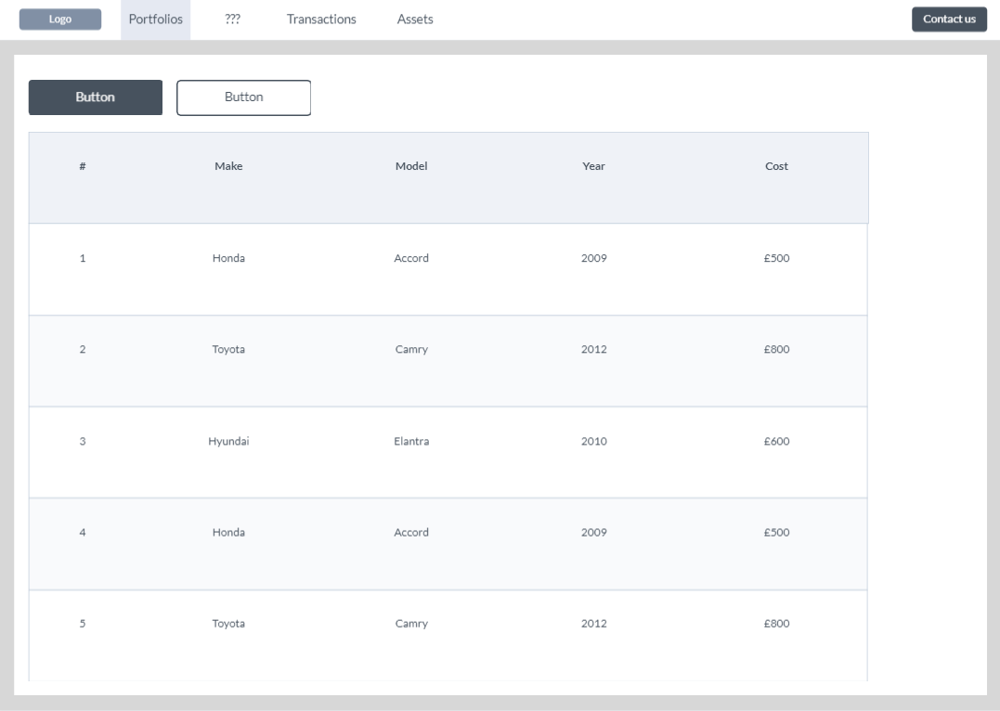
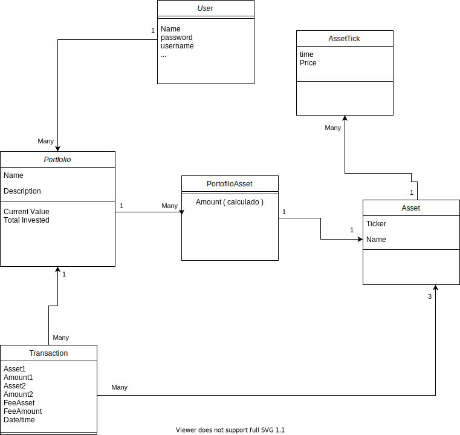

# investment-portfolio

## Website design

Using [marvelapp.com](https://marvelapp.com) we design this basic mockup.



## Class diagram

Using [draw.io](https://draw.io) we design a this diagram.



## Tasks

Using the [Github projects page](https://github.com/algarvis/investment-portfolio/projects/1) of the repo we created a few tasks that still need more work to be useful.

## Unanswered Questions

1. What appends when a user tries to add a transaction where we does not have the totally of the sold asset?

    * Show a negative balance of the asset
    * Show a alert or error 

2. 

## Technology

**Frontend:** We will use react with Ant design for the normal components. For chart and analytics components we have not decided yet.

**Backend:** We will ne using python3 Django with the Django Rest Framework.

**Hosting:** Not the current priority but eventually we will try to host it using Google Cloud.


## Setup Django to run locally

First make sure you have python3 installed on your machine.

```
$ cd djano
$ python3 -m venv env
$ source env/bin/activate  # On Windows use `env\Scripts\activate`
$ pip install -r requirements.txt
$ python .\manage.py runserver
```
